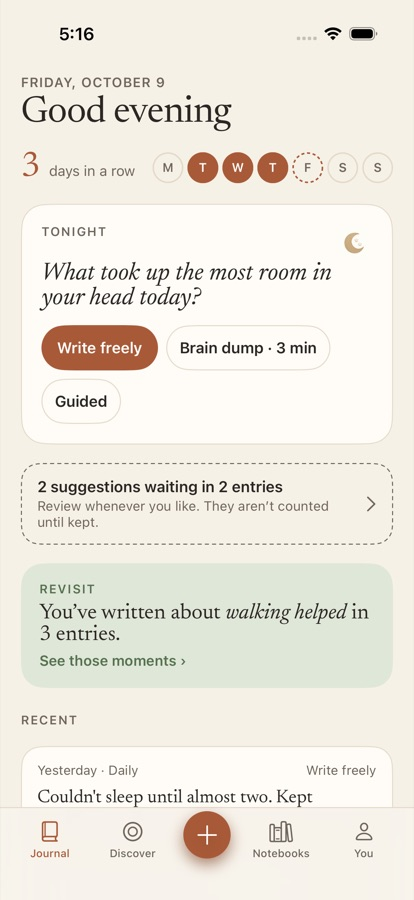
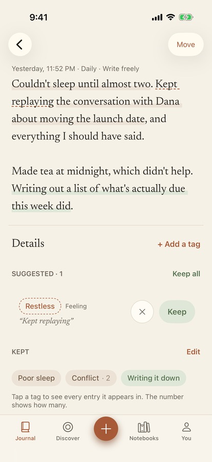
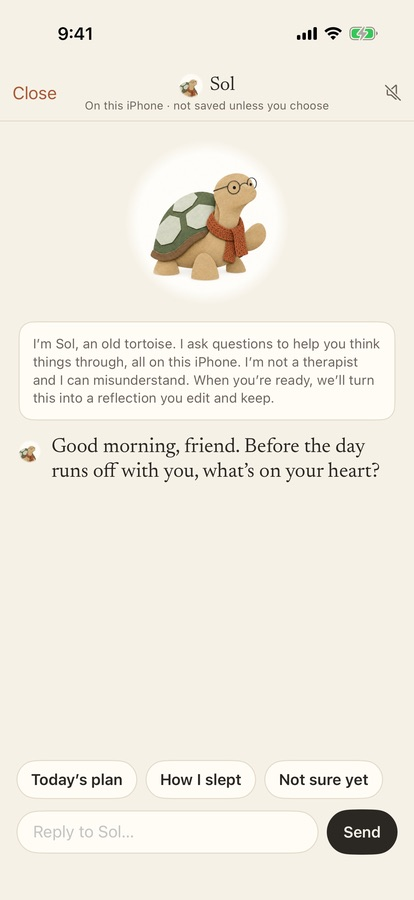
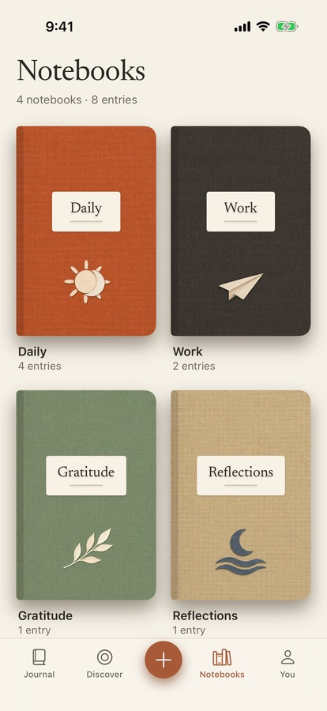
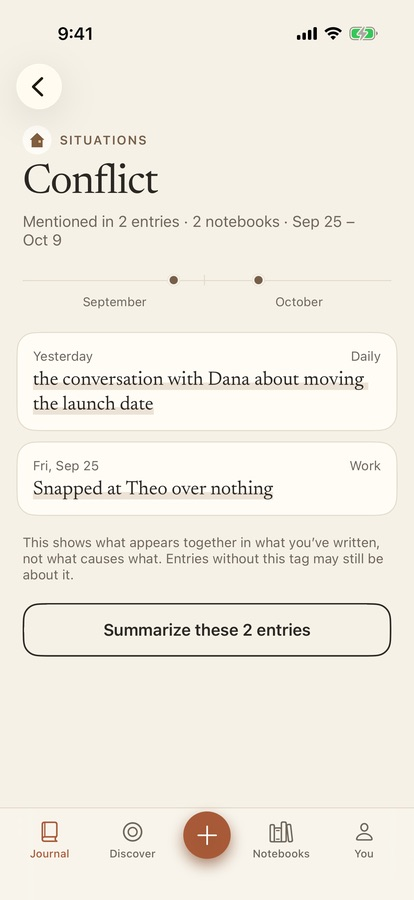
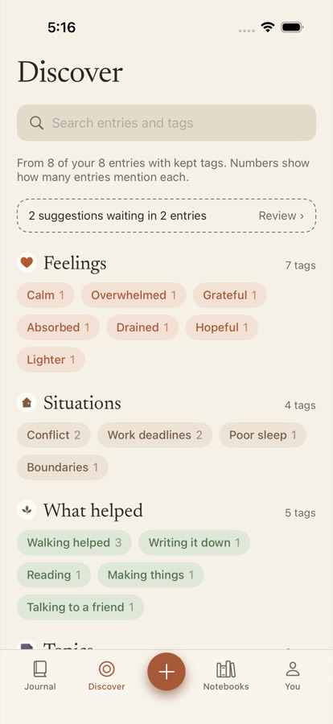
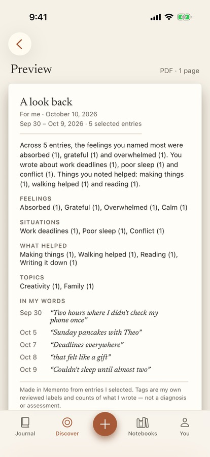
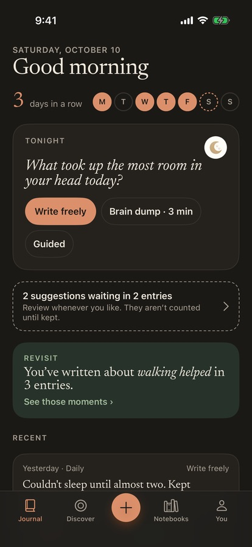

<p align="center"></p>

<h1 align="center">Memento</h1>

<p align="center"><em>Write naturally. Notice gently. Find it again.</em></p>

Memento is a private journal for iPhone. On-device AI suggests the details in what you wrote: how you felt, what was hard, what helped. Each suggestion is tied to your exact words, so you can find those moments again later. **Sol** (short for Solomon), a wise old paper tortoise, talks things through with you and helps turn the conversation into a reflection you keep.

All AI runs on the iPhone through Apple's Foundation Models framework, and the app makes no network calls. Your writing leaves the phone only when you export or share it yourself.

<p align="center">
  
  
  
  
</p>
<p align="center">
  
  
  
  
</p>

## What it does

- **Write.** Four modes: free writing, a three-minute brain dump, guided prompts, and photo entries. Dictation runs on the device too. Saving is instant and never waits for AI.
- **Notice.** After you save, the on-device model suggests up to four tags: a feeling, a situation, what helped, and a topic. Each one highlights the words behind it. Dashed means suggested, filled means kept. You can keep, edit, remove, or undo any of them.
- **Find again.** A kept tag opens every related moment across your notebooks, on a timeline that also shows which other tags appear alongside it.
- **Reflect with Sol.** Sol streams its replies, asks one gentle question at a time, and drafts a reflection only from your own words. Sol's mood shows in his pose: waving hello, listening, thinking, reading beside your notebook, tucked in his shell to rest.
- **Summaries.** A factual, deterministic one-page PDF, for yourself or to bring to an appointment. It counts only tags you kept.

## On-device AI

| | How |
|---|---|
| Tagging | The system language model returns `EntryDetails`, with one optional slot per kind. Each slot holds a verbatim quote and a label constrained to a curated vocabulary (`@Guide(.anyOf(...))`). A sanitizer drops anything that isn't grounded in your text. See [`FoundationModelTagger.swift`](Packages/MementoCore/Sources/MementoCore/AI/FoundationModelTagger.swift). |
| Sol | One `LanguageModelSession` per conversation, seeded with what's on screen, streaming `@Generable` turns of a reply plus two quick replies. The persona lives in [`SolCharacter.swift`](Packages/MementoCore/Sources/MementoCore/AI/SolCharacter.swift). |
| Safety | Crisis language skips the model and shows a support card. Sol is capped at 12 turns, never claims memory or a therapist role, and never diagnoses. |
| No AI? | Every journaling feature still works. Ineligible devices get honest "not available" states and manual tags. |

## Run it

Requirements: Xcode 26, iOS 26. For live AI you need an Apple Intelligence iPhone (iPhone 15 Pro or newer) or the simulator on an Apple Intelligence Mac.

1. Open `Memento.xcodeproj`.
2. Select the **Memento** target, then under Signing & Capabilities pick your Team. A personal team is fine.
3. Run on your iPhone or the iPhone 17 Pro simulator.
4. Optional: go to **You → Demo → Load sample journal** for a populated journal. The Demo section also previews every AI state and has backup engines for stage demos.

## Tests

```bash
cd Packages/MementoCore && swift test          # 67 tests; live-model tests run where Apple Intelligence is available
xcodebuild -project Memento.xcodeproj -scheme Memento \
  -destination 'platform=iOS Simulator,name=iPhone 17 Pro' test   # UI tests, including RealAITests against the live model
```

## How it was made

- **Design:** recreated from a claude.ai/design prototype (`design-reference/Memento Prototype.dc.html`). The spec and implementation plan are in [`docs/superpowers`](docs/superpowers).
- **Art:** a paper-cut illustration kit generated with Codex image generation. Codex workers were orchestrated through Orca and did images only. The style bible, briefs, and review verdicts are in [`design-assets/`](design-assets).
- **Code:** SwiftUI and SwiftData, with an app target plus a `MementoCore` Swift package for models, domain logic, and AI engines.

## Credits

- Typefaces: [Newsreader](https://github.com/productiontype/Newsreader) and [JetBrains Mono](https://github.com/JetBrains/JetBrainsMono), both SIL Open Font License. See [`Licenses/`](Licenses).
- Sol is not a therapist. If you're struggling, please reach out to someone you trust or a local helpline.
